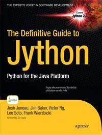

#Apress Source Code

This repository accompanies [*The Definitive Guide to Jython*](http://www.apress.com/9781430225270) by Josh Juneau, Jim Baker, Frank Wierzbicki, Leo Soto Muoz, Victor Ng, Alex Ng, and Donna L. Baker (Apress, 2010).

Download the files as a zip using the green button, or clone the repository to your machine using Git.

##Releases

Release v1.0 corresponds to the code in the published book, without corrections or updates.

##Contributions

See the file Contributing.md for more information on how you can contribute to this repository.
